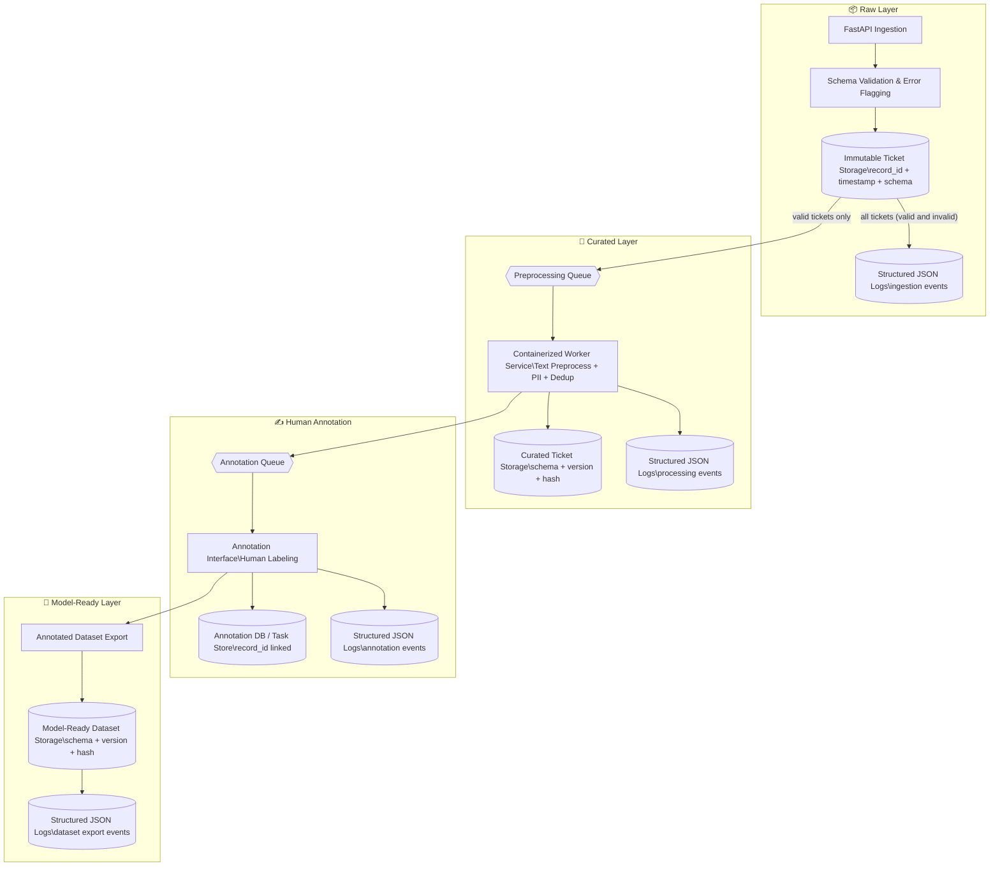

# 🧩 **System Design Proposal For A Text Annotation Pipeline**

## 🧾 Summary
This document outlines a pragmatic, evolvable text annotation pipeline to supply high-quality labeled data for an intent classification model.

Following a **Minimum Viable Product (Stage 1)** approach, the system ingests raw support tickets through a FastAPI service that assigns deterministic `record_id`s, validates structure, and stores all records immutably in a partitioned data lake for auditability and replay.

Valid tickets are handed off via RabbitMQ to a containerized worker service that performs preprocessing, PII redaction, and deduplication using text and fuzzy hashing before publishing tasks to a human annotation queue, where annotators label intents in a lightweight interface.

Annotation reliability is determined exclusively through inter-annotator agreement, while Confidence Score (CS) is stored as separate metadata derived automatically from historical agreement within semantic similarity clusters, and exact duplicates are rate-limited per day to avoid annotation overload without sacrificing lineage.

**Structured JSON logs** capture record-level lineage events at each transition, while dataset snapshots are versioned for reproducibility using DVC on object storage.

In **future stages (Stage 2+)**, complexity is added only if justified by system scale and sprint priorities, including formal orchestration (Airflow), OpenLineage event emission, lineage visualization/governance (Marquez), service observability (Prometheus + Grafana), data quality anomaly detection (e.g., Sifflet/Monte-Carlo-style checks), log management tools (ELK Stack) and annotation performance dashboards.

This incremental roadmap demonstrates a **Scrum-aligned, sustainable evolution of governance and observability**, delivering early value without premature infrastructure overhead.

## 🗺️ 1. Architectural Diagram

## 🧱 2. Component Description

| Component | Description |
| --------- | ----------- |
| **FastAPI Ingestion Service** | Receives raw text tickets from various sources. Generates a **deterministic record ID**, validates the schema with Pydantic, flags invalid tickets, and stores all tickets in the Raw Layer. |
| **Raw Layer Storage (Data Lake)** | Stores all ingested tickets (valid and invalid) as immutable Parquet snapshots. Each record contains `record_id`, timestamp, validation status, schema version, and optional error type. Ensures reproducibility and completeness of raw data. |
| **Structured JSON Logs** | Logs key events at each stage (ingestion, preprocessing, annotation, dataset export) in a machine-readable format, including record ID, status, timestamp, and error type if any. Enables end-to-end traceability and run-level auditing. |
| **RabbitMQ Preprocessing Queue** | Holds messages for downstream ML workers. Only **valid tickets** are published here. Ensures decoupling between ingestion and automated preprocessing. |
| **Containerized Worker Service**  | Consumes tickets from the preprocessing queue. Performs text preprocessing (Spacy + custom rules), PII redaction (Presidio), and deduplication: first removing exact duplicates using a deterministic hash of the cleaned text, then detecting near-duplicates using MinHash + LSH (Datasketch). Stores processed tickets in the Curated Layer and logs structured events. |
| **Annotation Queue (RabbitMQ)** | Receives preprocessed and cleaned tickets for human labeling. Ensures annotators work only on valid, deduplicated, and privacy-compliant data. |
| **Annotation Interface (e.g., Prodigy)** | Human annotators label intents of tickets. Annotations are stored in the Annotation DB/Task Store linked via `record_id`. |
| **Model-Ready Layer Storage** | Aggregates annotated tickets into a final dataset for model training. Each export is versioned, schema-checked, and logged with run ID and structured events. |

## 🛠️ 3. Technology Justification

| Component | Technology Choice | Justification |
| --------- | ----------------- | ------------- |
| Ingestion Service | **FastAPI + Pydantic** | Lightweight, easy to deploy, validates schema automatically, Python-native (smooth integration with ML pipeline). |
| Message Queues | **RabbitMQ** | Lightweight queueing system, supports decoupled asynchronous processing, widely used in production pipelines. |
| Raw / Curated / Model-Ready Storage | **Parquet files on S3 / Data Lake** | Columnar format supports large-scale storage, compression, schema evolution; immutable snapshots enable reproducibility. |
| Structured Logging | **JSON logs + local / centralized log storage** | Machine-readable logs provide auditability, traceability, and lineage reconstruction without additional orchestration complexity. |
| Text Preprocessing | Spacy + Custom Rules | Efficient NLP pipeline for tokenization, normalization, and custom cleaning rules; integrates easily with Python worker service and ensures consistent text formatting before deduplication and annotation. |
| PII Detection & Redaction | Microsoft Presidio | Detects and redacts sensitive personal information (PII) in tickets to comply with privacy requirements; runs alongside deduplication in the preprocessing worker to ensure annotated data is privacy-compliant. |
| Deduplication | **Exact text hashing + Datasketch (MinHash + LSH)** | Dedup is applied as a load-shedding, not data-loss mechanism: exact duplicates are allowed for annotation until a daily threshold of identical cleaned texts is reached, after which additional copies are stored in the Raw Layer but not enqueued for human annotation. Near-duplicates are grouped using MinHash + LSH to support agreement analysis. |
| Annotation Interface | **Prodigy** | Simple human-in-the-loop labeling interface, integrates with Python pipelines, supports custom labeling workflows. |
| Annotation DB | **PostgreSQL** | ACID compliance, strong schema enforcement, ideal for high-integrity labeled data. |
| Dataset Versioning  | **DVC + S3** | Tracks versions of datasets, hashes, and schema; integrates easily with ML pipelines, ensuring reproducibility. |

## 🔗 4. Data Governance

### 4.1 ML Data Layering Strategy

The pipeline organizes data into three immutable and versioned ML layers, each with a clear schema contract and reproducibility guarantees:
| Layer | Contains | Governance Properties |
| --------------- | --------------------------------------------------------------------------------------------------- | ------------------------------------------------------- |
| **Raw** | All ingested tickets, deterministic `record_id`, timestamps, schema version, validation/error flags | Immutable snapshots, schema-tracked, hashed, replayable |
| **Curated** | Preprocessed text, PII-redacted content, fuzzy-deduplicated records, processing metadata | Versioned, schema-enforced, reproducible transforms |
| **Model-Ready** | Human-annotated intents, exported training datasets | Versioned, schema-validated, reproducible and auditable |

Each layer stores a schema definition file (e.g., `raw_tickets.schema.v1.json`) alongside snapshot hashes to guarantee deterministic reprocessing and verification.

### 4.2 Record-Level Lineage

Lineage is tracked at the individual ticket level using:

#### 1. Deterministic `record_id` assigned at ingestion

- This ID is propagated through every stage and stored in every layer, enabling traceability, debugging, and exact deduplication.

#### 2. Near-duplicate (semantic) similarity

- Semantic near-duplicates are not removed before annotation. Instead, they are grouped into similarity clusters using MinHash + LSH (e.g., Datasketch) in the Curated Layer. These clusters serve as a historical signal source to compute inter-annotator agreement and automatically derive the Confidence Score (CS) for labels, while preserving each ticket as a distinct raw record for lineage and auditing.

### 4.3 Event-Based Lineage (Log-Based)

Instead of a full orchestrator at Stage 1, the system emits structured JSON log events at each key transition. Example logged events include:

- `{"event": "ingested", "record_id": "...", "status": "valid"|"invalid", "error_type": "...", "timestamp": "..."}`

- `{"event": "preprocessed", "record_id": "...", "snapshot_hash": "...", "schema_version": "v2", "timestamp": "..."}`

- `{"event": "annotation_completed", "record_id": "...", "annotator_id": "...", "timestamp": "..."}`

- `{"event": "dataset_exported", "dataset_version": "v5", "source_snapshot": "...", "record_count": 1234, "timestamp": "..."}`

These logs allow reconstruction of lineage chains such as:
_Raw ticket → preprocessing → annotation task → final dataset export, without requiring an early Airflow/OpenLineage setup._

### 4.4 Dataset Versioning & Reproducibility

Dataset state is versioned using DVC backed by object storage (e.g. S3 or self-hosted MinIO), ensuring:

- Every dataset export (e.g., training dataset from Prodigy) is stored immutably and hashed.

- Version metadata includes:

    - schema version

    - snapshot hash (md5, sha256, or DVC object hash)

    - record_id coverage

    - source snapshot reference

    - export timestamp

- Any dataset version can be reproduced or replayed by reprocessing the exact Raw snapshot and transformation logs.

### 4.5 Governance Roadmap (Agile Evolution)

Stage 1 establishes **log-based lineage + deterministic record IDs + fuzzy dedup + DVC versioning**, delivering end-to-end traceability with minimal infrastructure overhead. Future stages can be added through Scrum sprints only when scaling needs justify them:

- **Stage 2:** Introduce orchestration (Airflow) + OpenLineage event emission + Marquez UI.

- **Later sprints:** Add service monitoring (Prometheus + Grafana), data quality anomaly detection (e.g., Sifflet/Monte-Carlo-style observability), log management tools (e.g ELK stack), and annotation performance dashboards.

This **ensures a sustainable, governed pipeline** that evolves in complexity without compromising reproducibility, auditability, or early value delivery.
